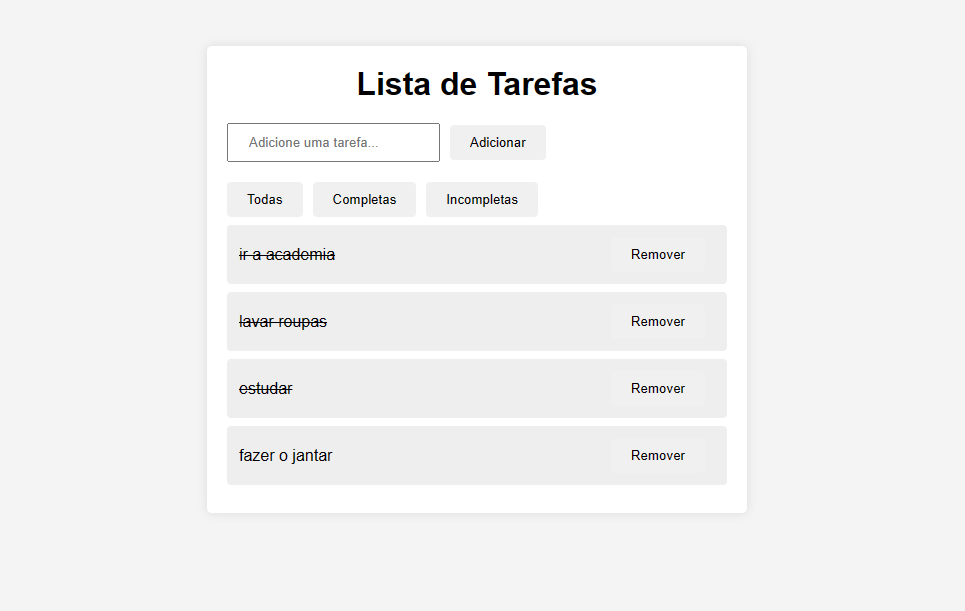

# Lista de Tarefas Simples com React.js

Este é um projeto simples de lista de tarefas desenvolvido utilizando React.js. Ele permite aos usuários adicionar, marcar como concluída e excluir tarefas da lista.

## Funcionalidades

- Adicionar uma nova tarefa
- Marcar uma tarefa como concluída (para isso clique duas vezes em cima da tarefa adicionada)
- Excluir uma tarefa da lista

